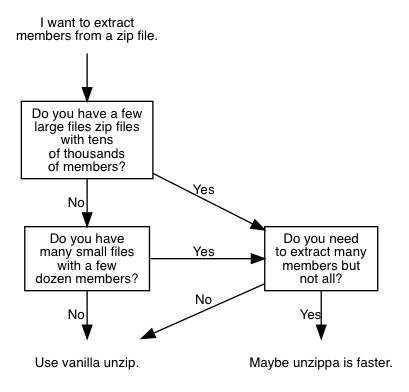

# unzippa
A faster version of a special [unzip](https://linux.die.net/man/1/unzip) use case.



Usage
-----

Where with vanilla [unzip](https://linux.die.net/man/1/unzip) you would write:

```shell
$ unzip -p <archive> <member> <member> <member> ...
```

You might hit the an error saying: *Argument list too long* - and maybe you do
not want to mess with
[ARG_MAX](https://www.in-ulm.de/~mascheck/various/argmax/)?

Unfortunately, `unzip` does not allow a file with members passed as list of
archive members:

> An **optional list of archive members to be processed, separated by spaces**.
(VMS versions compiled with VMSCLI defined must delimit files with commas
instead. See -v in OPTIONS below.) **Regular expressions (wildcards) may be
used** to match multiple members; see above. Again, be sure to quote expressions
that would otherwise be expanded or modified by the operating system.

This is the gap, that `unzippa` fills:

```shell
$ unzippa -m <members-file> <archive>
```

This attempts to extract all members given in *members-file*, one per line, to
stdout. This will work with hundreds or thousands of members. By default,
stdout is used, optionally an output file can be set via -o flag.

Performance
-----------

A fake file: Zipfile with 100000 files, and 10000 entries to extract. In this
very special case, unzippa seems about 150x faster than plain unzip.

```shell
$ unzip -l fixtures/fake.zip | sed '1,3d;$d' | sed '$d' | wc -l
100000

$ time unzip -p fixtures/fake.zip $(cat fixtures/fake.txt | tr '\n' ' ')
real    0m20.564s
user    0m19.978s
sys     0m0.146s

$ time unzippa -m fixtures/fake.txt fixtures/fake.zip

real    0m0.138s
user    0m0.136s
sys     0m0.038s
```

Misc
----

An executable `unzippall` is included in package since 0.1.4.

The unzippall tool takes a list of filenames and extracts them to stdout in
parallel. Works in parallel, order is not preserved.

Usage:

```
$ find /tmp/updates -type f -name "*zip" | unzippall -i '.*xml' > data.file
```

Performance: Finding 45000 files with `find`, about 2s. Finding files and
running `unzip -p` on each of them: 13min. Using `unzippall` on the same
fileset: about 2min.
