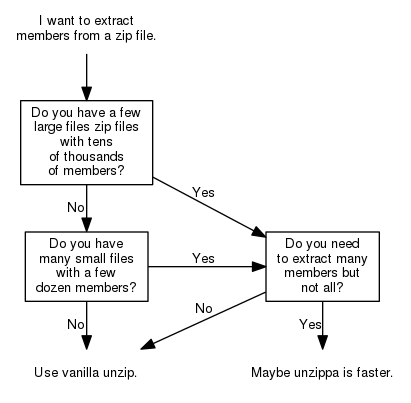

# unzippa
A faster version of a special unzip use case.



Usage
-----

Where with vanilla unzip you could write:

```shell
$ unzip -p <archive> <member> <member> <member> ...
```

You might hit the an error saying: *Argument list too long*. And you do not
want to mess with `ARG_MAX`?

Unfortunately, `unzip` does not allow a file with members passed as list of
archive members:

> An optional list of archive members to be processed, separated by spaces.
(VMS versions compiled with VMSCLI defined must delimit files with commas
instead. See -v in OPTIONS below.) Regular expressions (wildcards) may be used
to match multiple members; see above. Again, be sure to quote expressions that
would otherwise be expanded or modified by the operating system.

This is the gap, that `unzippa` fills:

```shell
$ unzippa -p -m <members-file> <archive>
```

This attempts to extract all members given in *<members-file>*, one per line,
to stdout. This will work with hundreds or thousands of members.
